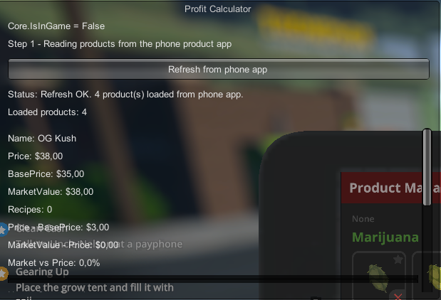

# 🧪 In Progress - Profit Calculator

**Status:** 🟠 In Progress
**Version:** v0.1
**Type:** Mod / Feature
**Target Project:** Schedule I
**Main Objective:**
> Create a Profit Calculator capable of reading useful product data and displaying it in a usable in-game interface.

**Final Vision:**
> A clean interface, ideally linked to the phone or product app, that displays useful information about products, their recipes, ingredients, costs, and estimated profit.

---

## 🧱 Architecture

### Core
- Mod initialization via MelonLoader
- Harmony PatchAll loading
- Management of the mod's overall state
- Launching necessary scans

### UI
- Basic window can be shown/hidden
- Display of retrieved information
- Current keyboard toggle system on F6
- Interface still in its early stages

### Data
- Product scanning
- Reading of certain useful information
- Beginning of recipe/ingredient/price retrieval
- Data still incomplete or to be confirmed

### Hooks / Integration
- Using the mod within the game context
- Desire to link behavior to the product/phone application
- Keyboard input currently too general or poorly placed depending on the context

### Debug
- Mod loading logs
- Initialization verification
- Window opening tests
- Product data retrieval tests

---

## ⚙️ Progress

### 🧩 Core
- [x] Mod loaded correctly
- [x] Loading message displayed
- [x] Harmony PatchAll active
- [x] Project base created
- [ ] Finer scene/context management

### 🧩 UI
- [x] Window visible in-game
- [x] DrawWindow base in place
- [x] Displaying a first functional interface
- [ ] Interface closed by default only when necessary
- [ ] Opens only in the correct context
- [ ] Clean integration with the product/phone application
- [ ] Improved layout
- [ ] Clean scrolling when necessary
- [ ] Cleaner buttons/actions

### 🧩 Data
- [x] Product scanning started
- [x] First display of product information
- [x] Retrieving some useful values ​​started
- [ ] Confirm successful retrieval of all Recipes
- [ ] Confirm correct ingredient retrieval
- [ ] Confirm correct price retrieval
- [ ] Confirm correct basePrice retrieval
- [ ] Structure data properly
- [ ] Prepare actual profit calculation

### 🧩 Input
- [x] F6 toggle implemented
- [ ] Determine if input should remain keyboard input or be accessed via an in-game button
- [ ] Restrict opening to a specific context
- [ ] Prevent opening at the wrong time

### 🧩 Integration
- [ ] Precisely identify the best target related to the phone/Product App
- [ ] Determine how to retrieve the correct data at the right time
- [ ] Connect the interface to the actual game flow
- [ ] Make the player experience more natural

### 🧩 Debug
- [x] Base logs present
- [x] Loading check Performed
- [x] Initial display tests completed
- [ ] Add more precise logs for input F6
- [ ] Add logs for the application context
- [ ] Reduce errors and false tests
- [ ] Clean up logs when behavior is stable

---

## 🔍 Technical Discoveries

- The mod loads correctly and Harmony works.

- A basic interface can already be displayed in-game.

- The scanning system has started retrieving useful product data.

- The project is progressing towards reading recipes, ingredients, prices, and base prices.

- The behavior of the F6 toggle seems to be causing problems in the context of the product application.

- The current interface works as a testbed, but not yet as a final integration.

### Assumptions
- The product application or the phone modifies how the input is captured.

- Some useful data already exists in the product objects but still needs to be correctly read or structured.

- The best final result will likely come from integration into the phone's UI rather than a simple free-standing window.

### Important Targets
- `Core.cs`
- `Scan.cs`
- `DrawWindow`
- Product/Phone Application System
- Input System in Play

---

## 🧠 Issues Encountered

### ❌ The interface opens/still exists as a global testing tool
- **Description:** The current window serves as a technical basis but is not yet properly linked to the correct context.

- **Probable Cause:** The opening logic is still too general.

- **Impact:** The experience is not yet natural or finalized.

- **Status:** In progress

### ❌ The useful data is not yet fully reliable
- **Description:** Recipes, ingredients, prices, and basePrice are not all properly validated yet.

- **Probable cause:** The exact data structure is not yet fully confirmed.

- **Impact:** It is currently impossible to create a complete and reliable Profit Calculator.

- **Status:** In progress

---

## 🛠 Tested Solutions

### ✔ Mod Base
- **Action:** Creation of the MelonLoader + Core + PatchAll project.
- **Result:** OK
- **Notes:** The mod loads correctly.

### ✔ Basic Interface
- **Action:** Implementation of an initial in-game window.
- **Result:** OK
- **Notes:** A good starting point for displaying future data.

### ✔ Initial Scan
- **Action:** Start of the scanning system to retrieve products.

- **Result:** OK
- **Notes:** Initial data is retrieved, but the final structure still needs to be refined.

### ✔ Toggle F6
- **Action:** Added a key to show/hide the window.

- **Result:** OK
- **Notes:** Works as a base, but has issues in the final product application.

---

## 🛠 Technical Choices

- **Main Technology:** C#
- **Framework / Loader:** MelonLoader
- **Patch System:** Harmony
- **Interface Type:** Simple in-game testing UI
- **Target Project:** Schedule I

### Validated Choices
- Use MelonLoader for the mod's base
- Use Harmony for patches
- Start with a simple UI to validate data before further integration
- Build the scan first before refining the rendering

### Rejected / Discarded
- Start too early with a final UI without validating the data
- Make the project more complex before having a reliable data flow

---

## 📊 Current Status

### ✅ Working
- Mod loading
- Harmony initialization
- Project base
- First interface visible
- Product scanning begins
- First information displayed

### ⚠️ Partial
- Complete reading of product data
- Data structure
- Link between the interface and the correct game context

### ❗ To Do
- Stabilize the retrieval of recipes / ingredients / price / base price
- Transform the test tool into a fully functional feature
- Prepare the calculation of real profit
- Make the interface cleaner and more logical

---

## 🔮 Roadmap

### Phase 1 - Base
- [x] Create the mod
- [x] Load Harmony
- [x] Display a first window
- [x] Start scanning Products

### Phase 2 - Data Reading
- [ ] Finalize product retrieval
- [ ] Properly read recipes
- [ ] Properly read ingredients
- [ ] Properly read prices
- [ ] Properly read basePrice
- [ ] Structure data for calculations

### Phase 3 - Integration
- [ ] Link the interface to the correct context
- [ ] Integrate the tool into the product/phone application
- [ ] Prevent out-of-context opening

### Phase 4 - Actual Profit Calculator
- [ ] Calculate cost/profit
- [ ] Display results clearly
- [ ] Add sorting/readability/user-friendliness
- [ ] Prepare a cleaner version

### Phase 5 - Finalization
- [ ] Clean up the code
- [ ] Reduce unnecessary logs
- [ ] Test various scenarios
- [ ] Prepare a presentable version

---

## 🧾 Dev Notes

### Session - Project Base
- ProfitCalculator mod created
- Core installed
- MelonLoader load validated
- Harmony PatchAll validated
- System base ready

### Session - First UI
- Basic window created
- Functional in-game display
- Started opening/closing tests
- The tool now exists visually

### Session - Product Scanning
- Started work on scanning
- Searching for the correct product data
- Initial information displays
- Started retrieving recipes/ingredients/prices/basePrices

### Session - Current Blockage
- Issue with F6 in the product application
- The interface is not yet integrated into the correct final context
- Input and data now need stabilization

### 🔧 Interface Improvement – ​​Advanced Filtering System

**Objective :**
Enable intelligent recipe sorting to improve in-game decision-making.

---

**Planned Additions:**

* Sorting system with **up to 4 active filters**
* Available criteria:

* 💰 Price
* 📈 Profit (%)
* 🧪 Number of ingredients
* ✨ Effect (limited to 1)

---

**Design Choices:**

* Maximum 4 filters to avoid visual clutter
* Limited to 1 effect to maintain a clean UI (especially on mobile)
* Filter priority defined by order (Filter 1 → Filter 4)

---

**Intended Uses:**

* Find the most profitable recipe
* Adapt production according to customer preferences
* Optimize crafting (cost/complexity)
  
---

**Status:**
🟠 Under consideration (design approved, not yet implemented)

---

**Notes:**

* Feature planned after stabilization of the current system (scan + display)
* Possibility of evolving to include multiple effects later

---

## 📤 Export

### DevLog
- Mod base created
- First functional interface
- Product scanning started
- First data visible in-game
- Work started on recipes / ingredients / price / basePrice
- Interface transferred to application

### QA_Report
- F6 toggle issue in the product application
- UI integration still too rough/global
- Data still incomplete for final calculation

---

## 🧿 Free Notes

- The mod has already moved beyond the "idea" stage.

- The next major step is to stabilize data reading.

- The second critical point is deciding how the user opens the tool in the real-world context.

- Once recipes, ingredients, and prices are finalized, the core of the Profit Calculator can truly begin.

- Test on a large dataset to ensure all identities are correct.
